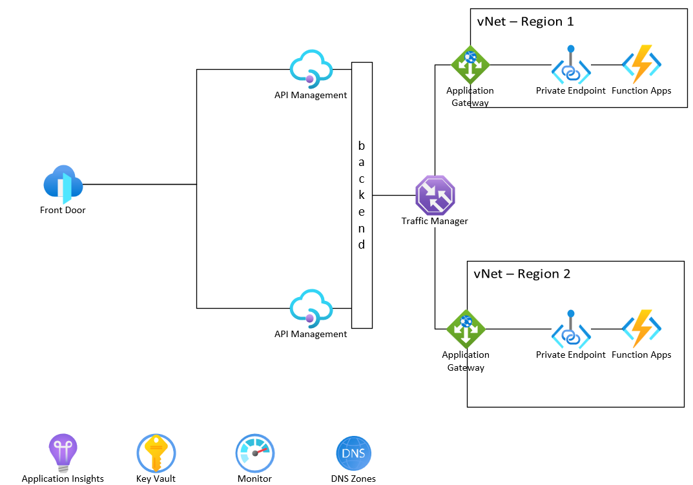

# apim-traffic-mgr

This repo shows how to set up a blue-green deployment environment for services hosted in a vNet & front-ended by [Azure API Management]()(APIM). In this example, [Azure FrontDoor](https://docs.microsoft.com/en-us/azure/front-door/overview) is used to direct traffic to the correct regional APIM. APIM will route the traffic to [Azure Traffic Manager](https://docs.microsoft.com/en-us/azure/traffic-manager/overview) to ensure that the traffic is distributed across multiple regions. The [Azure Application Gateway](https://docs.microsoft.com/en-us/azure/application-gateway/overview) is used to route traffic inside the vNet and to the [Azure Functions](https://docs.microsoft.com/en-us/azure/azure-functions/overview) to handle the API calls. If a regional AppGW refuses traffic (such as being down for upgrades), Traffic Manager will redirect traffic to the a different region.



## Disclaimer

**THE SOFTWARE IS PROVIDED "AS IS", WITHOUT WARRANTY OF ANY KIND, EXPRESS OR IMPLIED, INCLUDING BUT NOT LIMITED TO THE WARRANTIES OF MERCHANTABILITY, FITNESS FOR A PARTICULAR PURPOSE AND NONINFRINGEMENT. IN NO EVENT SHALL THE AUTHORS OR COPYRIGHT HOLDERS BE LIABLE FOR ANY CLAIM, DAMAGES OR OTHER LIABILITY, WHETHER IN AN ACTION OF CONTRACT, TORT OR OTHERWISE, ARISING FROM, OUT OF OR IN CONNECTION WITH THE SOFTWARE OR THE USE OR OTHER DEALINGS IN THE SOFTWARE.**

## Prerequisites

- [Azure CLI](https://docs.microsoft.com/en-us/cli/azure/install-azure-cli)
- [Dotnet CLI](https://docs.microsoft.com/en-us/dotnet/core/tools/)
- [curl](https://curl.se/)
- Azure subscription & resource group

## Deployment

1.  Update the `/infra/env/dev.parameters.json` file as needed.

1.  Execute the following Azure CLI command to deploy the infrastructure (change the email addresses & secret as needed).

    ```shell
    az deployment group create -g rg-apimTrafficMgr-ussc-dev --template-file ./infra/main.bicep --parameters ./infra/env/dev.parameters.json --parameters apiManagementServicePublisherName=dwightschrute apiManagementServicePublisherEmail=dwight.k.schrute@dunder-mifflin.com functionAppKey="SuperSecretSecurePassword" --query "properties.outputs"
    ```

    The command will output the various endpoints you will call to interact with the deployed infrastructure.

1.  Build & create the deployment package for the Azure Function.

    ```shell
    dotnet publish --configuration Release --output ./app/publish ./app
    Compress-Archive -DestinationPath ./app.zip -Update ./app/publish/*
    ```

1.  Deploy the Azure Function code.

    **NOTE: This example assumes you are on the same network as the Azure Functions (such as with a VPN Gateway or ExpressRoute). The Azure Functions have their inbound traffic routed via private endpoint and are not publically accessible.**

    ```shell
    az functionapp deployment source config-zip -g rg-apimTrafficMgr-ussc-dev -n func-apimTrafficMgr-ussc-dev --src ./app.zip
    ```

## Test Routing

To test this application, you will first hit the various endpoints of the application. Then, you will shut down the Application Gateway for the region that serves the initial requests (to simulate a blue-green deployment). Finally, you will hit the endpoints again and see that Traffic Manager is routing requests to the other region.

### Initial requests

Run the following commands to see that the API is running & available. Note which region is serving your requests (in this example, SOUTHCENTRALUS).

#### FrontDoor

**Command**

```shell
curl --header "Ocp-Apim-Subscription-Key: 7876c011952240fd9061685ba1bb6ec0" https://fd-apimTrafficMgr-ussc-dev.azurefd.net/api/application
```

**Output**

```shell
Howdy from SOUTHCENTRALUS!
```

#### API Management

**Command**

```shell
curl --header "Ocp-Apim-Subscription-Key: 7876c011952240fd9061685ba1bb6ec0" https://apim-apimtrafficmgr-ussc-dev.azure-api.net/api/application
```

**Output**

```shell
Howdy from SOUTHCENTRALUS!
```

#### Traffic Manager

**Command**

```shell
curl https://tm-apimtrafficmgr-ussc-dev.trafficmanager.net/api/application?code=SuperSecretSecurePassword
```

**Output**

```shell
Howdy from SOUTHCENTRALUS!
```

#### Application Gateway

##### Region 1

**Command**

```shell
curl https://ag-apimtrafficmgr-ussc-dev.southcentralus.cloudapp.azure.com/api/application?code=SuperSecretSecurePassword
```

**Output**

```shell
Howdy from SOUTHCENTRALUS!
```

##### Region 2

**Command**

```shell
curl https://ag-apimtrafficmgr-eus-dev.eastus.cloudapp.azure.com/api/application?code=SuperSecretSecurePassword
```

**Output**

```shell
Howdy from EASTUS!
```

#### Functions

##### Region 1

**Command**

```shell
curl https://func-apimtrafficmgr-ussc-dev.azurewebsites.net/api/application?code=SuperSecretSecurePassword
```

**Output**

```shell
Howdy from SOUTHCENTRALUS!
```

##### Region 2

**Command**

```shell
curl https://func-apimtrafficmgr-eus-dev.azurewebsites.net/api/application?code=SuperSecretSecurePassword
```

**Output**

```shell
Howdy from EASTUS!
```

### Bring down a region for upgrades & redirect traffic

#### Stop Application Gateway

Run the following CLI command to stop the Application Gateway in the region that served the initial API requests so we can see Traffic Manager failover (in this example, SOUTHCENTRALUS).

**Command**

```shell
az network application-gateway stop -g rg-apimTrafficMgr-ussc-dev -n ag-apimTrafficMgr-ussc-dev
```

After stopping the AppGW, you can verify that Traffic Manager has detected the AppGW is down (in this example, instead of USSC, forward to EUS).

```shell
az network traffic-manager profile show -g rg-apimTrafficMgr-ussc-dev -n tm-apimTrafficMgr-ussc-dev --query "endpoints[].{name: name, endpointLocation: endpointLocation, endpointMonitorStatus: endpointMonitorStatus}" --output table
```

```shell
Name                        EndpointLocation    EndpointMonitorStatus
--------------------------  ------------------  -----------------------
ag-apimTrafficMgr-ussc-dev  South Central US    Degraded
ag-apimTrafficMgr-eus-dev   East US             Online
```

### Rerun the initial requests & see that they are served from a different region

**Command**

```shell
curl --header "Ocp-Apim-Subscription-Key: 7876c011952240fd9061685ba1bb6ec0" https://fd-apimTrafficMgr-ussc-dev.azurefd.net/api/application
```

**Output**

```shell
Howdy from EASTUS!
```

## Links

- [Azure FrontDoor](https://docs.microsoft.com/en-us/azure/application-gateway/application-gateway-front-door-overview)
- [Azure API Management](https://docs.microsoft.com/en-us/azure/azure-api-management/overview)
- [Azure Traffic Manager](https://docs.microsoft.com/en-us/azure/traffic-manager/traffic-manager-overview)
- [Azure Application Gateway](https://docs.microsoft.com/en-us/azure/application-gateway/overview)
- [Azure Functions](https://docs.microsoft.com/en-us/azure/azure-functions/overview)
